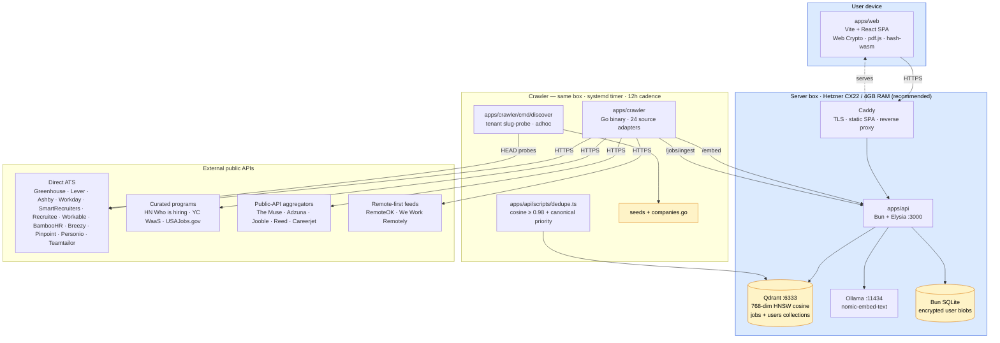

# OmniJOB — Architecture & Data Flow

Two views of the system:

1. **Infrastructure** — every running process, where it lives, what it talks to.
2. **Data flow (DFD)** — every piece of user data, where it crosses a trust boundary, where it lives at rest, and what is provably never seen by the server.

Both diagrams are kept in sync with the codebase. If a diagram and the code disagree, the code is right and the diagram is stale — please open a PR.

---

## 1. Infrastructure topology

### What's where

| Process | Host | Port | Role |
|---|---|---|---|
| Caddy | Server | 80 / 443 | TLS termination, static web, `api.<domain>` reverse proxy to :3000 |
| Bun API (Elysia) | Server | 3000 | `/health`, `/embed`, `/users/*`, `/jobs/*`, `/jobs/:id/sources` |
| Qdrant | Server | 6333 | 768-dim cosine, `jobs` + `users` collections, HNSW index |
| Ollama | Server | 11434 | `nomic-embed-text` always loaded |
| Bun SQLite | Server | n/a (file) | `users.db` — ciphertext blobs only |
| Crawler | Server | n/a | systemd timer every 12h, runs `apps/crawler` then `dedupe.ts` |
| Web SPA | User browser | n/a | served as static files by Caddy |

---

## 2. Data flow (DFD) with trust boundaries

The dashed line is the only boundary that matters. **Everything left of it is plaintext; everything right of it is ciphertext or unlinked vectors.** The server can be subpoenaed, breached, or sold and still cannot reconstruct a user's identity, résumé, applications, or saved searches.

```mermaid
flowchart LR
    subgraph trust1["Browser trust zone — plaintext OK"]
        EMAIL[Email]
        PASSWD[Password]
        RESUME[Résumé text<br/>or PDF]
        APPS[Applications<br/>Saved searches<br/>Bookmarks]

        ARGON([Argon2id KDF<br/>t=3 m=64MiB])
        PDFJS([pdf.js<br/>extract text])
        UNWRAP([AES-GCM<br/>unwrap DEK])
        ENCRYPT([AES-GCM<br/>encrypt blob])

        MK[Master Key]
        DEK[DEK]
        RECOVERY[Recovery Key<br/>32 bytes · shown once]
        BLOB_PT[Profile Blob<br/>plaintext]

        EMAIL --> SHA([SHA-256])
        SHA --> UID
        UID[uid]

        PASSWD --> ARGON
        ARGON --> MK
        MK --> UNWRAP
        UNWRAP --> DEK

        RECOVERY -. or unwrap with .-> UNWRAP

        RESUME -.-> PDFJS
        PDFJS --> RTEXT[résumé text]
        RTEXT -- POST /embed --> EMBED_OUT[résumé vector]

        RTEXT --> BLOB_PT
        APPS --> BLOB_PT
        EMBED_OUT --> BLOB_PT
        BLOB_PT --> ENCRYPT
        DEK --> ENCRYPT
    end

    BOUNDARY{{Trust boundary · TLS}}
    ENCRYPT --> BOUNDARY
    UID --> BOUNDARY
    EMBED_OUT --> BOUNDARY

    subgraph trust2["Server trust zone — ciphertext + unlinked vectors only"]
        EMBED_PROXY([API /embed<br/>Bun · Ollama proxy])
        OLLAMA_P([Ollama<br/>nomic-embed-text])
        BLOB_CT[(SQLite<br/>encrypted blob<br/>keyed by uid)]
        QD_USERS[(Qdrant users<br/>random point id<br/>≠ uid)]
        QD_JOBS[(Qdrant jobs<br/>16k+ public postings)]
        SEARCH_API([API /jobs/search<br/>Bun + Qdrant cosine NN])

        EMBED_PROXY --> OLLAMA_P
        OLLAMA_P --> EMBED_PROXY

        BOUNDARY -- résumé text --> EMBED_PROXY
        EMBED_PROXY -- vector back --> BOUNDARY
        BOUNDARY -- ciphertext blob --> BLOB_CT
        BOUNDARY -- random-id vector --> QD_USERS

        BOUNDARY -- query vector --> SEARCH_API
        SEARCH_API --> QD_JOBS
        QD_JOBS --> SEARCH_API
        SEARCH_API -- top-K hits --> BOUNDARY
    end

    subgraph trust3["External sources — public job postings only"]
        ATS_EXT[Greenhouse · Lever · Ashby<br/>Workday · SmartRecruiters · etc.]
    end

    subgraph crawler_zone["Crawler trust zone — server-internal"]
        CRAWLER([apps/crawler<br/>24 source adapters])
        DEDUP_PROC([dedupe.ts<br/>cosine ≥ 0.98])

        ATS_EXT -- HTTPS GET --> CRAWLER
        CRAWLER -- job text --> EMBED_PROXY
        EMBED_PROXY -- job vector --> CRAWLER
        CRAWLER -- /jobs/ingest --> QD_JOBS
        QD_JOBS -. read .-> DEDUP_PROC
        DEDUP_PROC -. mark is_active=false .-> QD_JOBS
    end

    classDef plaintext fill:#fee2e2,stroke:#dc2626,color:#000
    classDef ciphertext fill:#dcfce7,stroke:#16a34a,color:#000
    classDef public fill:#e0e7ff,stroke:#6366f1,color:#000
    classDef boundary fill:#fbbf24,stroke:#92400e,color:#000

    class EMAIL,PASSWD,RESUME,APPS,RTEXT,MK,DEK,RECOVERY,BLOB_PT plaintext
    class BLOB_CT,QD_USERS ciphertext
    class QD_JOBS,ATS_EXT public
    class BOUNDARY boundary
```

### Per-field disclosure (mirrors the `/privacy` page)

| Field | Plaintext where | Server sees | Encrypted with |
|---|---|---|---|
| Email | Browser only | **never** | n/a — only the SHA-256 hash leaves |
| Password | Browser only | **never** | n/a — only Argon2id-derived material is used |
| Master Key | Browser memory | **never** | n/a — derived per-session |
| DEK | Browser memory | **never** | wrapped by master key + by recovery key |
| Recovery Key | Shown once at signup | **never** | independent wrapper for the DEK |
| Résumé text | Browser memory | **transit only** (sent to `/embed`, not persisted) | DEK in profile blob |
| Skill vector | Browser memory · Qdrant | yes — at a random point ID with no link to uid | n/a (the point itself, not the linkage) |
| Applications | Browser memory | **never** | DEK in profile blob |
| Saved searches | Browser memory | **never** | DEK in profile blob |
| Bookmarks | Browser memory | **never** | DEK in profile blob |
| Job postings | Public source | yes (these are public) | n/a |
| `uid` | Browser + server | derived value (`SHA-256(lowercased_email)`) | n/a |

### Structural impossibilities

These aren't promises — they are mathematical facts about the protocol:

1. **The server cannot reset a password.** The DEK is wrapped only by the master key and the recovery key. Without one of those, the cryptographic auth tag fails on every decryption attempt and no support tool can override it.
2. **The server cannot link a skill vector to a user.** The vector lives at a Qdrant point ID generated client-side with no derivation from `uid` or email. The mapping `uid → point_id` is held only inside the encrypted blob.
3. **The server cannot tell a wrong password from a right one.** Both produce a master key; only AES-GCM auth-tag verification (which runs in the browser, on the encrypted blob) distinguishes them. The server returns ciphertext regardless.
4. **The server cannot re-derive a user's email from `uid`.** SHA-256 is one-way; the email never travels to the server.

---

## 3. Where the architecture is changing

| Change | Status | Diagram impact |
|---|---|---|
| Cross-source dedup (cosine ≥ 0.98) | ✅ shipped | Adds the `dedupe.ts → QD_JOBS` arrow above |
| Tenant auto-discovery | ✅ shipped | Adds the `cmd/discover` lane in infrastructure view |
| Source-provenance UI (`/jobs/:id/sources`) | ✅ shipped | New endpoint on the API; no flow change |
| `salary_period` schema normalization | ✅ shipped | Adapter cleanup; no flow change |
| React Native client | ⏳ deferred | Will re-use the same trust-zone boundaries |
| Edge / cloud deploy | ⏳ open | Server-zone box may split (Qdrant Cloud vs Ollama-on-VPS) |
| Paid aggregator (SerpApi for LinkedIn / Indeed) | ⏳ revenue-gated | Adds a new `External sources` row |
